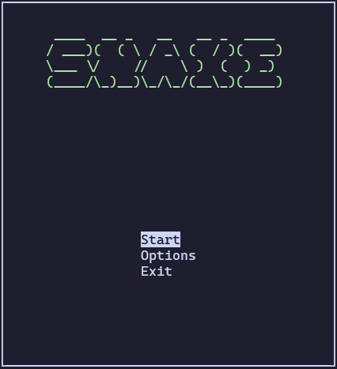
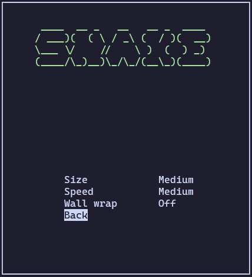
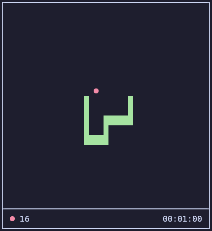

# cSNAKE

This is the classic game of snake for the terminal in C using the ncursesw library.





## Running the game

To play just execute the snake binary found the releases page.

## How to play

- <kbd>w</kbd> or <kbd>UP</kbd> to move up
- <kbd>s</kbd> or <kbd>DOWN</kbd> to move down
- <kbd>a</kbd> or <kbd>LEFT</kbd> to move left
- <kbd>d</kbd> or <kbd>RIGHT</kbd> to move right

- <kbd>q</kbd> to quit the game
- <kbd>p</kbd> to pause the game
- <kbd>ENTER</kbd> or <kbd>q</kbd> to return to menu when the game is over

## Build on linux

### Ubuntu

Install the ncursesw library by using:

```sh
sudo apt install libncursesw6
```

To compile the code in C use the standard GCC compiler by including the library:

```sh
gcc -o snake snake.c -lncursesw
```
